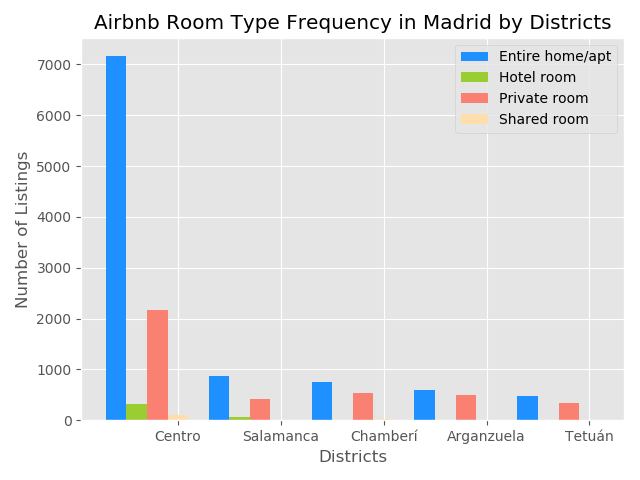
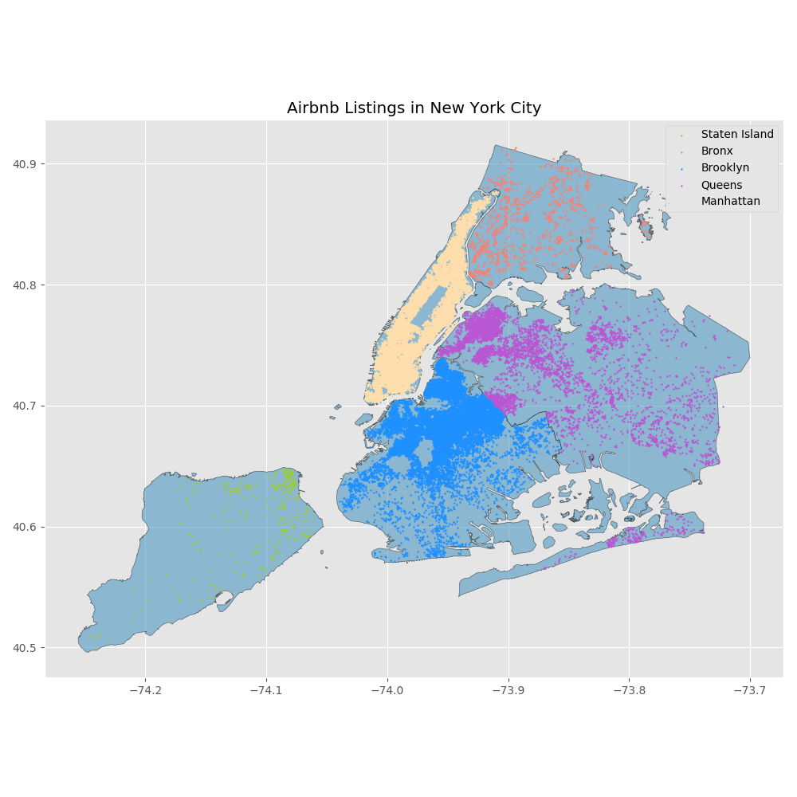

# Airbnb EDA in New York City Vs. Madrid
Capstone 1 project for Galvanize Data Science Immersive, Week 4  
*By Abel Desta* 

# Introduction

## Data 
I found this dataset on kaggle, which was sourced from [InsideAirbnb](http://insideairbnb.com/index.html). The website is an independent, non-commercial set of tools and data that allows you to explore how Airbnb is really being used in cities around the world. 

The dataset for this project is Airbnb data for New York City and Madrid. Combined it contains 69732 listings within 16 columns. 

## Goals 
- Demonstrate my EDA, statistical analysis and visualization skills.
- Explore the Airbnb dataset for an opportunity to compare the New York City and Madrid markets, use a hypothesis test if warranted.

## Data Description 
If you looking for an updated verison of New York City, Madrid, or other Airbnb cities it can be found at [InsideAirbnb](http://insideairbnb.com/get-the-data.html), which is updated every month or so. 

I only reviewed the listing.csv file because my computer had hard time processing the other files. The website linked above also has review and booking data files available for most cities.

Each listing had 16 attributes, 20837 listings in Madrid and 48895 listings in New York City
- Listing Id
- Name of the Listing 
- Host Id
- Host Name
- Neighbourhood Group - i.e. Boroughs or Districts
- Neighbourhood
- Latitude 
- Longitude
- Room Type - i.e.
    - Entire home/apartment 
    - Private Room
    - Shared Room
    - Hotel Room
- Price
- Minimum Nights
- Number of Reviews 
- Reviews Per Month
- Calculated Host Listings Count
- Availability (Days)

# Exploratory Data Anaysis
I first wanted to get an understanding of each city before getting into anything else.

### NYC

    
    

**Figure 1. Frequency of listings in each borough and the top 20 neighborhoods.**

The first couple things that interested me was the frequency of listings in each borough and the top 20 neighborhoods. In the left chart you see that Brooklyn and Manhattan are by far listing location. Which is not surprising since all main tourist attractions, such as sporting events, landmarks, and popular parks, are mostly located in those two boroughs. 

In the right chart you see the same graph but the frequency is grouped by neighbourhoods. One aspect I wanted to find from this graph is how many neighborhoods each of the boroughs had in the top 20. 

| Borough | Neighborhood Count |
| ------- | ------------------ |
| Manhattan | 12 |
| Brooklyn | 7 |
| Queens | 1 |
| Staten Island | 0 |
| Bronx | 0 |

**Table 1. Number of top 20 neighborhoods in each districts.**

Digging deeper into the listings in each borough, I wanted to see whether room types change depending on location. 

    

**Figure 2. Frequency of each room type separated by borough.**

Here you see that entire homes or apartment are the most popular for host listing in Manhattan, where as in every other borough private rooms are the most popular host listing. Shared rooms are the least common room type across all boroughs. 

There were three other columns I spent some time looking into: Price, Calculated Host Listings Count, Availablity

#### Price 

| Borough | Min Price | Mean Price | Max Price |
| ------- | --------- | ---------- | --------- |
| Manhattan | 0 | 196.87 | 10000 |
| Brooklyn | 0 | 124.38 | 10000 |
| Queens | 10 | 99.52 | 10000 |
| Staten Island | 13 | 114.81 | 5000 |
| Bronx | 0 | 87.50 | 2500 |

**Table 2. Minimum, Mean, and Maximum prices in each borough.**

There is not surprise that Brooklyn and Manhattan are the most expensive borough for bookings in New York City. A few thing I found interesting is that were the extreme outliers in Manhattan, Brooklyn and Queens each having a listing worth $10,000. Queens is the second cheapest borough from this dataset which makes it more surprising. On the same note, Staten Island is the popular location in terms of host listings yet its mean price is only $10 dollars cheaper than Brooklyn. 

#### Host Listing Count

| Area | Min Count | Mean Count | Max Count |
| ------- | --------- | ---------- | --------- |
| Manhattan | 1 | 13 | 327 |
| Brooklyn | 1| 2 | 232 |
| Queens | 1 | 4 | 103 |
| Staten Island | 1 | 2 | 8 |
| Bronx | 1 | 2| 37 |
| NYC | 1 | 7.14 | 327 |

**Table 3. Minimum, Mean, and Maximum number of listings in New York City.**

I thought it would be interesting to look into the number of listings each host had because Airbnb started as a company that helped people make extra cash on their primary property when they went on vacation or had an extra room a person could staying in while on vacation. I found that mean number of listings is about 7 in New York City. That number is heavyily skewed by upper 25th percentile because the 75th percentile is 2 listings per host and a standard deviation of 33 listings. When digging in deeper into the host with a count over 10 listings, I found that most host posting the listings were hotels like companys or small scale real estate investors.  

#### Availability 

| Borough | Mean Days | 
| ------- | --------- |
| Manhattan | 112 |
| Brooklyn | 100 | 
| Queens | 144.45 | 
| Staten Island | 200 | 
| Bronx | 166 |

**Table 4. Minimum, Mean, and Maximum days a listing is available for booking in each borough.**

I wanted to look into availability thru out the year to see if the host complied with the Airbnb or State "rules" on short term regulations. According to Multiple Dwelling Law in NYC, a host is not allowed to rent a property less than 30 days if property is in a multi-family building or the host is not present for the stay. Based on my EDA until this point, I'm sure Airbnb doesnt enforce this "rule". When I check the mean number of days the listings were able to be booked Manhattan and Brooklyn were approximately available for booking 3-4 months out of the year. The other three borough were available about 6 months out of the year, I would assume that is the case because of the lack of popularity in these areas. 

### Madrid

    
    

**Figure 3. Frequency of listings in each district and the top 20 neighborhoods in Madrdid.**

One thing to point out is that Madrid has 21 districts which is quite a bit more than NYC 5 boroghs, so I decide to drop anaylsis to the top 10 districts. The EDA for Madrid for the most part was the same process. The aspect that pops out in the left chart is the the listings in Madrid are heavily concentrated in Centro, more so than NYC. On the right, listings are more evenly distributed, but we have to check where how many top 10 neighborhoods are in the districts.

| District | Neighborhood Count |
| ------- | ------------------ |
| Centro | 6 |
| Chamberí | 5 |
| Salamanca | 4 |
| Retiro | 1 |
| Tetuán | 1 |
| Latina | 1 |
| Moncloa - Aravaca | 1 |
| Arganzuela | 1 |

**Table 5. Number of top 20 neighborhoods in each districts.**

Here you can see the small difference of how the popular neighborhoods are distrbuted in Madrid than NYC.

    

**Figure 4. Frequency of each room type separated by top 5 districts.**

In Madrid, it looks like entire homes or apartment is a majority of the market and hotel room is a new category. 

Digging deeper into price, host listings counts, and availability in Madrid. 

Here I wanted to have geographic visualization that shows the popular borough and districts for host listing.

    
    

**Figure 5. Geographical Plot of host listings in each borough in NYC and each district in Madrid..**

Here you get a geographic representation of data covered above. Manhattan and Brooklyn are the most popular areas for host. In Madrid, we see that listings are heavily concentrated in the center of madrid and as you get further from the center listings get less concentrated.

#### Price

| District |  Min Price | Mean Price | Max Price |
| -------- | ---------- | ---------- | --------- |
| Centro | 10 | 129.87 | 9999 |
| Ciudad Lineal | 8 | 115.53 | 3000 |
| Salamanca | 10 | 152.78 | 8930 |
| Retiro | 9 | 116.48 | 6000 |
| Tetuán | 12 | 160.77 | 8601 |
| Latina | 9 | 125.72 |1890 |
| Moncloa - Aravaca | 9 |  116.84 | 2950 |
| Carabanchel | 9 | 80.11 | 3000 |
| Puente de Vallecas | 9 | 85.73 | 4000 |
| Arganzuela | 8 |  93.80| 8465 |

**Table 6. Minimum, Mean, and Maximum prices in each top 10 district.**

#### Host Listing Count

| District |  Min Count | Mean Count | Max Count |
| -------- | ---------- | ---------- | --------- |
| Centro | 1 | 14 | 231 |
| Ciudad Lineal | 1| 3 | 110 |
| Salamanca | 1 | 21 | 231 |
| Retiro | 1 | 9 | 231 |
| Tetuán | 1 | 10 | 231 |
| Latina | 1 | 9 | 124 |
| Moncloa - Aravaca | 1 |  10 | 156 |
| Carabanchel | 1 | 5 | 56 |
| Puente de Vallecas | 1 | 5| 51 |
| Arganzuela | 1 |  6| 156 |
| Madrid | 1 |  12| 231 |

**Table 7. Minimum, Mean, and Maximum number of host listings in each top 10 district.**

#### Availability 

| District |  Mean Count |
| -------- | ----------- |
| Centro | 157 | 
| Ciudad Lineal | 154|
| Salamanca | 149.30 | 
| Retiro | 150| 
| Tetuán | 151 | 
| Latina | 152| 
| Moncloa - Aravaca | 151 |
| Carabanchel | 172 | 
| Puente de Vallecas | 169 |
| Arganzuela | 128 | 
| Madrid | 155 | 

**Table 8. Minimum, Mean, and Maximum days a listing is available for booking in each district.**

## Hypothesis Tests

#### Manhattan vs New York City

* **Null Hypothesis:** Mean price of Manhattan and all other boroughs are equal.
* **Alternative Hypothesis:** Mean price of NYC is greater than mean price of Madrid.
* **Signifance level** = 0.05
* **P Value** = 0.0000

We reject the null hypothesis, Manhattan's mean price is more expenvsive than all other boroughs combined. 

#### Madrid vs New York City 

* **Null Hypothesis:** Mean price of NYC and Madrid are equal.
* **Alternative** Hypothesis: Mean price of NYC is greater than mean price of Madrid.
* **Signifance level** = 0.05
* **P Value** = 0.0000

We reject the null hypothesis, New York City's mean price is more expenvsive than Madrid. 

#### Manhattan vs Madrid

* **Null Hypothesis:** Mean price of Manhattan and Madrid are equal.
* **Alternative** Hypothesis: Mean price of Manhattan is greater than mean price of Madrid.
* **Signifance level** = 0.05
* **P Value** = 0.0000

We reject the null hypothesis, Manhattan's mean price is more expenvsive than Madrid. 

#### Manhattan vs Centro

* **Null Hypothesis:** Mean price of Manhattan, NY and Centro, Madrid are equal.
* **Alternative** Hypothesis: Mean price of Manhattan, NY is greater than mean price of Centro, Madrid.
* **Signifance level** = 0.05
* **P Value** = 0.0000

We reject the null hypothesis, Manhattan's mean price is more expenvsive than Centro, Madrid. 

# References
Short-term Rental Regulations in New York City, NY. https://www.useguestbook.com/short-term-rental-regulations/new-york-city/

Quinn, Michelle P Esq. (2017, July) Short-Term (Airbnb) Rentals Are Not Only Illegal But Also Now More Costly. https://www.gdblaw.com/Short-Term-Rentals

Inside Airbnb. http://insideairbnb.com/index.html